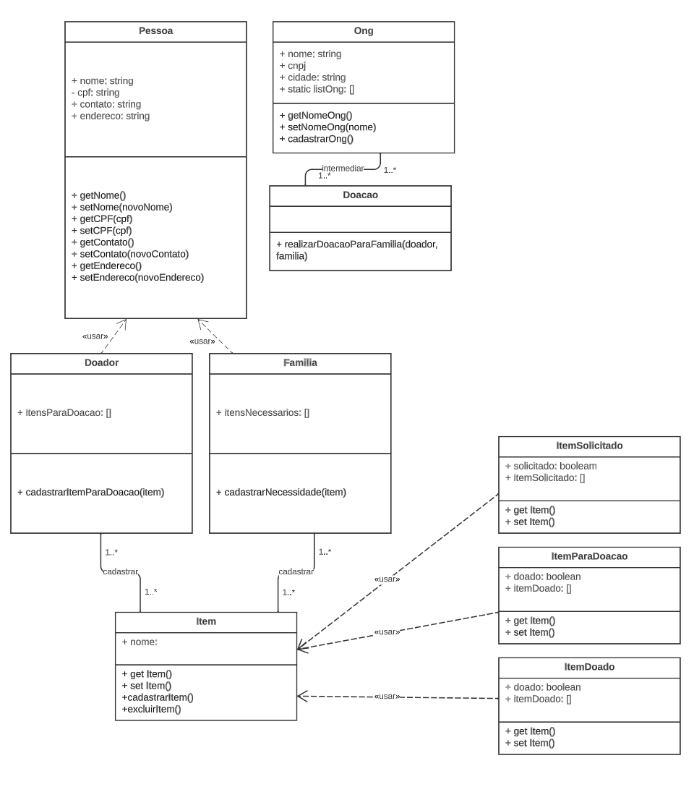
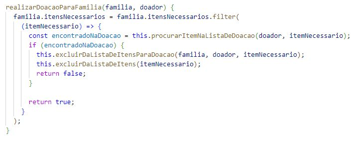
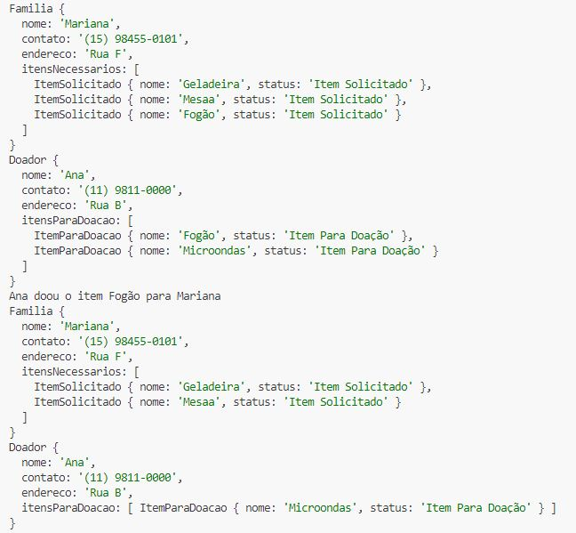
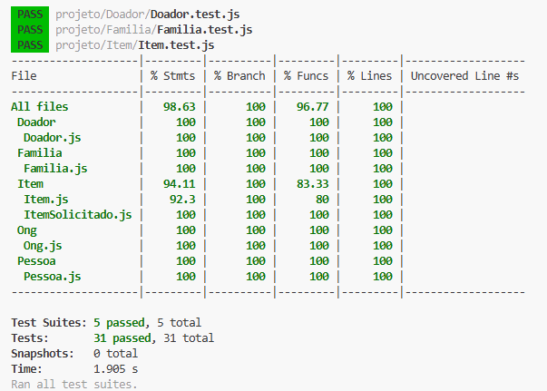

# Apresentação
## Heloiza
[foto aqui]
Resido em ,  etc.

## Jeanne

Resido em Porto Velho - Rondônia, sou mãe de um menino de 6 anos. 
Amo gatos, cachorros e hamsters. Tenho uma hamster Sírio chamada Tess. 
Meu passatempo preferido é assistir doramas e meu esporte é natação.
No momento, estou estudando para me tornar uma desenvolvedora e realizar minha transição de carreira. 

# Problema
O problema que buscamos resolver com a aplicação é a dificuldade que enfrentamos quando queremos doar algo a quem precisa ou quando precisamos de alguma coisa e não sabemos quem está doando.
Quem nunca teve uma coisa para doar e devido a não encontrar alguem que precisa, jogou no lixo?

# Projeto Doe

A idéia do projeto é que uma organização sem fins lucrativos gerencie um cadastro de doadores e de familias que precisam de itens como eletrodomésticos, roupas, móveis etc.
Cada doador pode incluir itens a sua lista de doações e a familia pode cadastrar itens que está precisando. Assim a organização fica responsável por intermediar a doação dos itens.

## Diagrama UML
<h1>
  
</h1>

## Funcionalidades
- Cadastrar ONG
- Cadastrar doador
- Cadastrar familia
- Cadastrar item para disponibilizado para doação
- Cadastrar item que a família está precisando
- Verificar na lista do doador se tem o item que a familia precisa e em caso positivo realizar a doação
- Listar todos itens disponiveis para doação
- Listar todos itens solicitados pelas famílias

## Função realizarDoacaoParaFamilia
<h1>
  
</h1>

## Exibindo a lista antes e depois de realizada a doação
<h1>
  
</h1>

## Testes unitários
<h1>
  
</h1>

## Aprendizados

O principal desafio do projeto foi determinar quais classes e suas dependências que seriam implementadas. 
Depois, realizar a manipulação das listas, utilizando as funções find, filter e index. Com isso 
conseguimos observar o comportamento das funções e aprendemos a utilizar cada uma delas dependendo da situação.
Alem disso, conseguimos entender melhor o funcionamento da variável static e avaliamos sua utilização dentro do projeto.

## Implementações futuras

- Cadastro de membros nas familias
- Listagem de todos os itens doados
- Busca de todos os doadores e familias para verificação de itens disponíveis e familias que estão precisando

