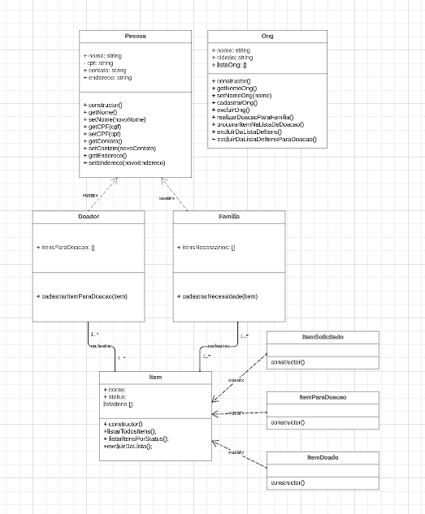

# Problema
O problema que buscamos resolver com a aplicação é a dificuldade que enfrentamos quando queremos doar algo a quem precisa ou quando precisamos de alguma coisa e não sabemos quem está doando.
Quem nunca teve uma coisa para doar e devido a não encontrar alguem que precisa, jogou no lixo?

# Projeto Doe

A ideia do projeto é que uma organização sem fins lucrativos gerencie um cadastro de doadores e de famílias que precisam de itens como eletrodomésticos, roupas, móveis etc. Cada doador pode incluir itens a sua lista de doações e a família pode cadastrar itens que está precisando. Assim a organização fica responsável por intermediar a doação dos itens sem a necessidade da interação direta entre quem está doando e quem vai receber a doação.

## Diagrama UML
<h1>
  
</h1>

## Funcionalidades
- Cadastro de ONG, Família e Doador;
- Cadastrar item para doação e que está necessitando
- Verificar na lista do doador o item que a familia precisa e em caso positivo realizar a doação;
- Listar todos itens disponiveis para doação;
- Listar todos itens solicitados pelas famílias.

## Trecho de código
<h1>
  
</h1>

## Testes unitários
<h1>
  
</h1>

## Implementações futuras

- Cadastro de membros nas familias
- Listagem de todos os itens doados

## Tecnologias Utilizadas
- Node.js com npm
- Jest

## Como rodar o projeto
1. Clone este repositório: `git clone https://github.com/heloeng/projetoDoe.git`
2. Navegue até o diretório do projeto: `cd projeto`
3. Instale as dependências: `npm install`.

## Autoras

- [@Heloiza Mendes](https://github.com/heloeng)
- [@Jeanne Mendes](https://github.com/jeannefernanda)
